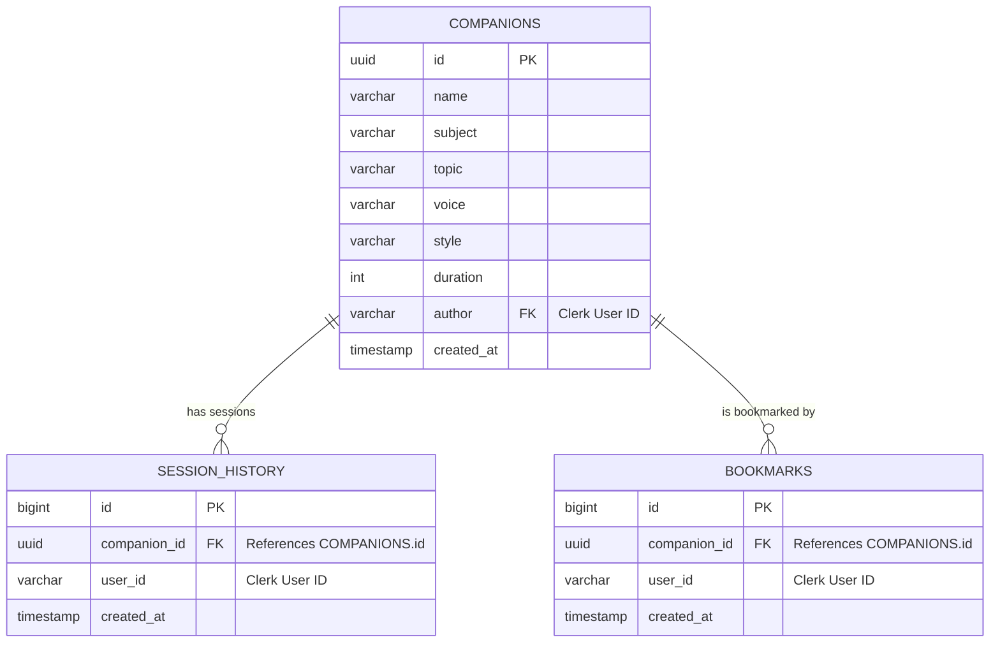

# 🎓 CodeSensei: Real-Time AI Vocal Coding Companions

CodeSensei is an interactive, voice-first learning platform designed to help developers master Core Computer Science subjects and coding interviews. Built with Next.js 15, Vapi AI (WebRTC), Supabase, and Clerk, CodeSensei allows users to create customized AI vocal companions tailored to specific technical subjects, target speaking styles, and difficulty levels, conducting mock-interviews and learning sessions directly in the browser.

---

## 🚀 Key Features

*   🗣️ **Real-Time Voice Sessions:** Interactive voice-first coding lessons powered by **Vapi AI WebRTC SDK** with ultra-low latency, real-time speech-to-text transcripts, and dynamic soundwave animations (Lottie).
*   🛠️ **Custom Companion Creation:** Provision custom mentors by selecting technical subjects (DSA, System Design, Operating Systems, Computer Networks, Frontend, Backend, etc.), speaking tones (casual, formal), and gendered voice models.
*   🔒 **Workspace Scoping:** Private workspace isolation. Companions and user history are strictly scoped to the authenticated user via Supabase Row-Level Security (RLS).
*   📌 **Optimistic Bookmarking:** Instant companion bookmarking using React transitions (`useTransition`) for zero-latency user feedback.
*   📊 **Progress & Analytics Dashboard:** View complete session history, lessons completed, custom companions created, and bookmarked mentors.
*   🔋 **Self-Healing Cron Keep-Alive:** Automated serverless keep-alive endpoint (`/api/ping`) triggered via Vercel Crons to query Supabase every 3 days, preventing automatic database pausing.

---

## 🛠️ Technology Stack

| Layer | Technology | Purpose |
| :--- | :--- | :--- |
| **Frontend** | Next.js 15 (App Router), React 19, TypeScript | Server components, routing, modern state management |
| **Styling** | Tailwind CSS v4, Radix UI Primitives | Responsive visual layouts, interactive UI accordions |
| **Real-Time Voice** | `@vapi-ai/web`, WebRTC | Dual-channel real-time vocal communication and overrides |
| **Auth & Security** | Clerk Authentication | Identity management and custom JWT generation |
| **Database** | Supabase (PostgreSQL) | Structured storage, relations, and row-level access control |
| **Monitoring** | Sentry (Client, Server, Edge) | Full-stack error tracking and performance profiling |
| **Automation** | Vercel Cron Jobs | Keep-alive service execution and security validation |

---

## 📐 Architecture & Database Design

### Database Schema Relationships



---

## 🧠 Engineering Highlights & Architectural Solutions

### 1. Clerk-Supabase Custom JWT Mapping & RLS Type Casting Workaround
**The Problem:** Supabase's built-in `auth.uid()` function casts the JWT's `sub` claim into a UUID. However, Clerk uses text-based user IDs (e.g. `user_2xi...`). Directly using standard Supabase templates resulted in casting failures (`invalid input syntax for type uuid`) and crashed queries.
**The Solution:** Customized Row Level Security (RLS) policies to bypass the default UUID helper, parsing the Clerk string ID directly from the JWT claims:
```sql
-- Custom RLS policy using text-based ID matching
((select auth.jwt()) ->> 'sub') = author
```
This enabled secure row-level access control without database modifications.

### 2. Eliminating Query Waterfalls via Parallel Server Fetching
To maximize performance and keep server load times sub-200ms:
*   Replaced serial data fetching with concurrent parallelized query resolution (`Promise.all`).
*   Replaced heavy external Clerk API requests (`currentUser()`) with localized header token decryption (`auth()`) where appropriate to avoid blocking initial renders.
```typescript
// Parallel query optimization
const [companions, recentSessionsCompanion, bookmarkedCompanions] = await Promise.all([
  getAllCompanions({ limit: 3 }),
  getUserSessions(userId),
  getBookmarkedCompanions(userId)
]);
```

### 3. Vercel-Secured Database Heartbeat Daemon
**The Problem:** Free-tier Supabase databases auto-pause after 7 days of inactivity, disrupting portfolio visibility for recruiters.
**The Solution:** Built a serverless keep-alive route (`/api/ping`) executed automatically every 3rd day via Vercel Crons. In production, the endpoint is protected by verifying the internal Vercel Authorization header:
```typescript
export async function GET(request: NextRequest) {
  const authHeader = request.headers.get("authorization");
  if (
    process.env.NODE_ENV === "production" &&
    authHeader !== `Bearer ${process.env.CRON_SECRET}`
  ) {
    return new Response("Unauthorized", { status: 401 });
  }
  // Supabase ping query to keep the database awake...
}
```

---

## ⚙️ Environment Variables

Create a `.env` file in the root directory and configure the following parameters:

```env
# Clerk Auth
NEXT_PUBLIC_CLERK_PUBLISHABLE_KEY=your_clerk_publishable_key
CLERK_SECRET_KEY=your_clerk_secret_key
NEXT_PUBLIC_CLERK_SIGN_IN_URL=/sign-in

# Supabase Configurations
NEXT_PUBLIC_SUPABASE_URL=your_supabase_url
NEXT_PUBLIC_SUPABASE_ANON_KEY=your_supabase_anon_key

# Vapi Voice Assistant Token
NEXT_PUBLIC_VAPI_WEB_TOKEN=your_vapi_web_token

# Vercel Cron Authentication Secret
CRON_SECRET=your_vercel_cron_secret_key
```

---

## 🏃 Getting Started

### 1. Install Dependencies
```bash
npm install
```

### 2. Setup the Database
Run the following SQL commands in your Supabase SQL editor to initialize tables and enable RLS:

```sql
-- Companions Table
CREATE TABLE companions (
  id UUID DEFAULT gen_random_uuid() PRIMARY KEY,
  name TEXT NOT NULL,
  subject TEXT NOT NULL,
  topic TEXT NOT NULL,
  voice TEXT NOT NULL,
  style TEXT NOT NULL,
  duration INT NOT NULL,
  author TEXT NOT NULL,
  created_at TIMESTAMP WITH TIME ZONE DEFAULT timezone('utc'::text, now()) NOT NULL
);

ALTER TABLE companions ENABLE ROW LEVEL SECURITY;

CREATE POLICY "Allow users to read their own companions" 
ON companions FOR SELECT 
TO authenticated 
USING (((select auth.jwt()) ->> 'sub') = author);

CREATE POLICY "Allow users to insert their own companions" 
ON companions FOR INSERT 
TO authenticated 
WITH CHECK (((select auth.jwt()) ->> 'sub') = author);

-- Bookmarks Table
CREATE TABLE bookmarks (
  id BIGINT GENERATED BY DEFAULT AS IDENTITY PRIMARY KEY,
  companion_id UUID REFERENCES companions(id) ON DELETE CASCADE NOT NULL,
  user_id TEXT NOT NULL,
  created_at TIMESTAMP WITH TIME ZONE DEFAULT timezone('utc'::text, now()) NOT NULL
);

ALTER TABLE bookmarks ENABLE ROW LEVEL SECURITY;

CREATE POLICY "Users can manage their own bookmarks" 
ON bookmarks FOR ALL 
TO authenticated 
USING (((select auth.jwt()) ->> 'sub') = user_id)
WITH CHECK (((select auth.jwt()) ->> 'sub') = user_id);
```

### 3. Run Locally
```bash
npm run dev
```

Open [http://localhost:3000](http://localhost:3000) with your browser to experience the application.
