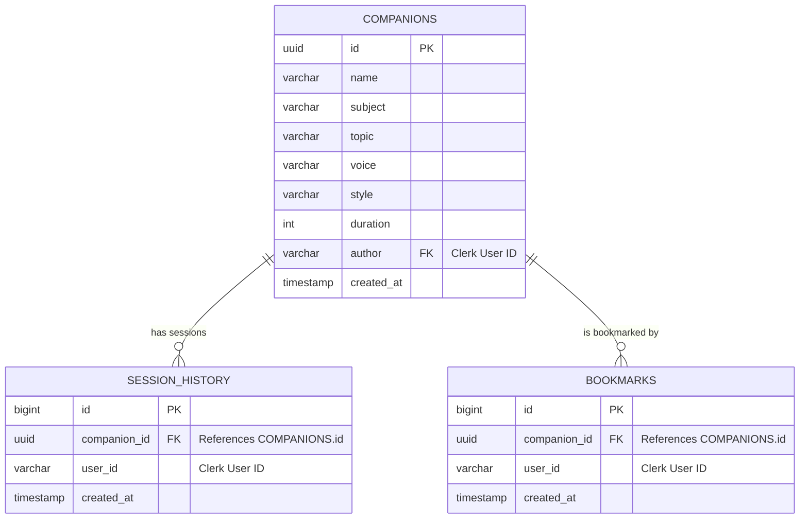

# CodeSensei: Real-Time AI Vocal Coding Companions

CodeSensei is an interactive, voice-first learning platform designed to help developers master Computer Science fundamentals and prepare for technical coding interviews. Built using Next.js 15, Vapi AI (WebRTC), Supabase, and Clerk, CodeSensei enables users to provision customized AI vocal companions tailored to specific technical subjects, target speaking styles, and custom voice models, facilitating mock-interviews and technical walkthroughs directly within the browser.

---

## Key Features

*   **Real-Time Voice Sessions:** Interactive voice-first coding lessons powered by the Vapi AI WebRTC SDK featuring low latency, real-time speech-to-text transcripts, and dynamic soundwave visualizations.
*   **Custom Companion Provisioning:** Create custom mentors by configuring technical subjects (such as DSA, System Design, Operating Systems, Computer Networks, Frontend, Backend, etc.), speaking styles (casual, formal), and specific voice models.
*   **Secure Workspace Scoping:** Private workspace isolation. Companions and user history are strictly scoped to the authenticated user using Supabase Row-Level Security (RLS) policies.
*   **Optimistic Bookmarking UI:** Instant companion bookmarking using React transitions (`useTransition`) for immediate visual feedback and zero-latency states.
*   **User Dashboard & History Tracking:** View progress metrics including lessons completed, custom companions created, and bookmarked mentors.
*   **Automated Keep-Alive Engine:** Scheduled serverless endpoint (`/api/ping`) executed via Vercel Crons every 3 days to keep the free-tier Supabase database active and prevent automatic pause triggers.

---

## Technology Stack

| Layer | Technology | Purpose |
| :--- | :--- | :--- |
| **Frontend** | Next.js 15 (App Router), React 19, TypeScript | Server components, static optimization, and modular state management |
| **Styling** | Tailwind CSS v4, Radix UI Primitives | Responsive layouts, accessible UI components, and design tokens |
| **Real-Time Voice** | `@vapi-ai/web`, WebRTC | Dual-channel real-time vocal communication and parameter overrides |
| **Auth & Security** | Clerk Authentication | Session handling, user management, and JWT claim signatures |
| **Database** | Supabase (PostgreSQL) | Relational storage, indexing, and Row-Level Security |
| **Monitoring** | Sentry (Client, Server, Edge) | Full-stack error tracing and performance monitoring |
| **Automation** | Vercel Cron Jobs | Keep-alive service execution and security validation |

---

## Architecture & Database Design

### Database Schema Relationships



---

## Technical Highlights & Engineering Decisions

### 1. Clerk-Supabase Custom JWT Mapping & RLS Type Casting Workaround
**The Challenge:** Supabase's native `auth.uid()` function implicitly casts the JWT's `sub` claim into a UUID. Because Clerk issues text-based user IDs (e.g. `user_2xi...`), utilizing default templates resulted in database casting errors (`invalid input syntax for type uuid`).
**The Solution:** Implemented customized PostgreSQL RLS policies that bypass the standard UUID parser, extracting the text-based Clerk user ID directly from the JWT claims:
```sql
-- Custom RLS policy using text-based ID matching
((select auth.jwt()) ->> 'sub') = author
```
This configuration secures tables without requiring schema type overrides.

### 2. Eliminating Query Waterfalls via Parallel Server Fetching
To improve performance and keep page load times under 200ms:
*   Parallelized page-level data fetching utilizing concurrent JavaScript promises (`Promise.all`).
*   Replaced blocking external API user calls (`currentUser()`) with localized header token signatures (`auth()`) to expedite server-side rendering.
```typescript
// Parallel query optimization
const [companions, recentSessionsCompanion, bookmarkedCompanions] = await Promise.all([
  getAllCompanions({ limit: 3 }),
  getUserSessions(userId),
  getBookmarkedCompanions(userId)
]);
```

### 3. Vercel-Secured Database Heartbeat Daemon
**The Challenge:** Free-tier Supabase instances auto-pause after 7 days of inactivity, creating deployment availability issues.
**The Solution:** Configured a serverless keep-alive route (`/api/ping`) triggered automatically every 3 days by Vercel Crons. In production, this endpoint is secured by validating the incoming bearer signature:
```typescript
export async function GET(request: NextRequest) {
  const authHeader = request.headers.get("authorization");
  if (
    process.env.NODE_ENV === "production" &&
    authHeader !== `Bearer ${process.env.CRON_SECRET}`
  ) {
    return new Response("Unauthorized", { status: 401 });
  }
  // Supabase ping query to keep the database awake...
}
```

---

## Environment Variables

Create a `.env` file in the root directory and configure the following parameters:

```env
# Clerk Auth
NEXT_PUBLIC_CLERK_PUBLISHABLE_KEY=your_clerk_publishable_key
CLERK_SECRET_KEY=your_clerk_secret_key
NEXT_PUBLIC_CLERK_SIGN_IN_URL=/sign-in

# Supabase Configurations
NEXT_PUBLIC_SUPABASE_URL=your_supabase_url
NEXT_PUBLIC_SUPABASE_ANON_KEY=your_supabase_anon_key

# Vapi Voice Assistant Token
NEXT_PUBLIC_VAPI_WEB_TOKEN=your_vapi_web_token

# Vercel Cron Authentication Secret
CRON_SECRET=your_vercel_cron_secret_key
```

---

## Getting Started

### 1. Install Dependencies
```bash
npm install
```

### 2. Setup the Database
Run the following SQL commands in your Supabase SQL editor to initialize tables and enable RLS:

```sql
-- Companions Table
CREATE TABLE companions (
  id UUID DEFAULT gen_random_uuid() PRIMARY KEY,
  name TEXT NOT NULL,
  subject TEXT NOT NULL,
  topic TEXT NOT NULL,
  voice TEXT NOT NULL,
  style TEXT NOT NULL,
  duration INT NOT NULL,
  author TEXT NOT NULL,
  created_at TIMESTAMP WITH TIME ZONE DEFAULT timezone('utc'::text, now()) NOT NULL
);

ALTER TABLE companions ENABLE ROW LEVEL SECURITY;

CREATE POLICY "Allow users to read their own companions" 
ON companions FOR SELECT 
TO authenticated 
USING (((select auth.jwt()) ->> 'sub') = author);

CREATE POLICY "Allow users to insert their own companions" 
ON companions FOR INSERT 
TO authenticated 
WITH CHECK (((select auth.jwt()) ->> 'sub') = author);

-- Bookmarks Table
CREATE TABLE bookmarks (
  id BIGINT GENERATED BY DEFAULT AS IDENTITY PRIMARY KEY,
  companion_id UUID REFERENCES companions(id) ON DELETE CASCADE NOT NULL,
  user_id TEXT NOT NULL,
  created_at TIMESTAMP WITH TIME ZONE DEFAULT timezone('utc'::text, now()) NOT NULL
);

ALTER TABLE bookmarks ENABLE ROW LEVEL SECURITY;

CREATE POLICY "Users can manage their own bookmarks" 
ON bookmarks FOR ALL 
TO authenticated 
USING (((select auth.jwt()) ->> 'sub') = user_id)
WITH CHECK (((select auth.jwt()) ->> 'sub') = user_id);
```

### 3. Run Locally
```bash
npm run dev
```

Open [http://localhost:3000](http://localhost:3000) with your browser to experience the application.
